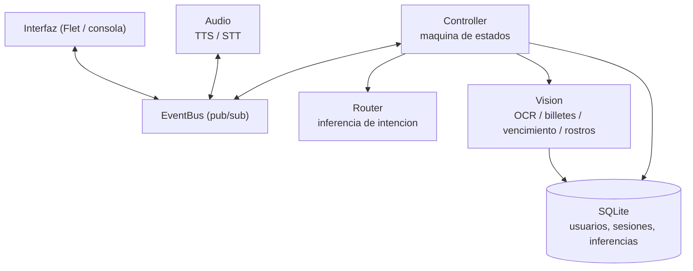

# OJOZ - Asistente virtual inclusivo

Asistente por voz en español que convierte información visual en audio para
apoyar a personas con discapacidad visual en tareas cotidianas: leer documentos,
identificar billetes y verificar fechas de vencimiento.

Proyecto universitario desarrollado en Python, con arquitectura en capas
orientada a objetos, comunicación desacoplada por eventos y persistencia
relacional de resultados.

---

## Descripción general

La interacción es enteramente por voz. El asistente saluda, registra o autentica
al usuario mediante reconocimiento facial y, a partir de ahí, atiende peticiones
habladas en lenguaje natural. Cada operación de visión por computador se ejecuta
sobre la cámara del equipo y su resultado se comunica al usuario por síntesis de
voz, además de registrarse en base de datos junto con su métrica de confianza.

## Funcionalidades

| Función | Descripción | Tecnología |
|---|---|---|
| Registro y autenticación | Enrolamiento con 20 capturas de calidad y verificación por embeddings | InsightFace (SCRFD + ArcFace) |
| Lectura de documentos | Extracción y lectura en voz alta del texto de un documento | Tesseract OCR |
| Identificación de dinero | Detección del valor de billetes y monedas de sol peruano | OpenCV, Tesseract |
| Verificación de vencimiento | Localización de la fecha de caducidad e indicación de si el producto está vigente | OpenCV, Tesseract |
| Interacción por voz | Reconocimiento de habla e inferencia de intención en español | SpeechRecognition, ElevenLabs/gTTS |
| Supresión de ruido | Limpieza del audio del micrófono antes de transcribirlo | DTLN (red neuronal) sobre ONNX Runtime |

## Arquitectura



El `Controller` mantiene una máquina de estados (`IDLE`, `TTS_SPEAKING`,
`LISTENING`, `PROCESSING`) que alterna los turnos entre voz y micrófono: mientras
el sintetizador habla, el reconocimiento de voz queda silenciado, y los flujos de
visión no se inician hasta recibir el evento `tts:end`. De este modo el asistente
no se escucha a sí mismo. Un hilo de vigilancia reactiva el micrófono si ese
evento no llega, evitando que la aplicación quede bloqueada.

Los módulos no se conocen entre sí: se comunican publicando y suscribiéndose a
eventos (`tts:start`, `tts:end`, `stt:text`, `ui:print`) sobre un bus con
bloqueo para uso concurrente.

### Supresión de ruido por red neuronal

El audio del micrófono se limpia antes de transcribirlo con **DTLN** (*Dual-signal
Transformation LSTM Network*), una red recurrente entrenada para separar voz de
ruido de fondo. Opera en dos etapas: la primera estima una máscara sobre el
espectro de magnitud y la segunda refina la señal en el dominio del tiempo,
recomponiendo el resultado por solapamiento y suma.

El modelo se ejecuta con ONNX Runtime sobre CPU: ocupa 4 MB, procesa a unas
veinte veces el tiempo real y sus pesos se distribuyen con el repositorio, por lo
que no requiere descargas ni conexión durante el uso. Si el modelo no estuviera
disponible, el audio se transcribe sin filtrar en lugar de interrumpir el
servicio.

El filtro de energía (SNR) se evalúa sobre el audio original —comparándolo con el
ruido de fondo medido en el propio micrófono— y solo se limpia lo que ya se
considera voz, de modo que el modelo no se ejecuta sobre ruido que iba a
descartarse.

### Selección del mejor fotograma

Los procesos de OCR, identificación de dinero y verificación de vencimiento no
analizan una única captura. Durante una ventana de varios segundos se puntúa cada
fotograma mediante criterios estadísticos de calidad de imagen (varianza del
laplaciano como medida de enfoque, brillo y contraste) y solo se procesan los
mejores candidatos, en un hilo separado del de previsualización.

## Modelo de datos

Base de datos SQLite con ocho tablas normalizadas, siete claves foráneas e
índices sobre las consultas frecuentes.

| Tabla | Contenido |
|---|---|
| `users` | Usuarios registrados |
| `face_photos` | Capturas de rostro asociadas a cada usuario |
| `enrollments` | Sesiones de enrolamiento y número de fotografías |
| `models` | Registro de modelos: tipo, versión, ruta, umbral de decisión, checksum y fecha de entrenamiento |
| `sessions` | Sesiones de uso, resultado y detalle |
| `ocr_results` | Texto extraído, idioma y confianza |
| `currency_detections` | Divisa, valor detectado y confianza |
| `expiry_checks` | Producto, fecha detectada, estado de vigencia y confianza |

Cada inferencia se almacena junto a su métrica de confianza y a la sesión que la
originó, lo que permite trazabilidad y análisis posterior del comportamiento de
los modelos.

## Stack tecnológico

- **Lenguaje:** Python 3.13
- **Visión por computador:** OpenCV, NumPy, imutils
- **OCR:** Tesseract mediante pytesseract
- **Reconocimiento facial:** InsightFace `buffalo_l` (detector SCRFD y embeddings ArcFace) sobre ONNX Runtime
- **Audio:** ElevenLabs/gTTS y pyttsx3 (síntesis), SpeechRecognition (reconocimiento), pygame
- **Supresión de ruido:** DTLN sobre ONNX Runtime
- **Interfaz:** Flet
- **Persistencia:** SQLite

## Requisitos previos

- Python 3.13
- Cámara web y micrófono
- Conexión a internet (el reconocimiento y la síntesis de voz usan servicios en línea)
- **Tesseract OCR** con el paquete de idioma español (`spa`).
  Descarga: <https://github.com/UB-Mannheim/tesseract/wiki>.
  Se busca por defecto en `C:\Program Files\Tesseract-OCR\tesseract.exe`; puede
  indicarse otra ruta mediante la variable de entorno `TESSERACT_CMD`.
- En la primera preparación, conexión a internet para descargar el paquete
  `buffalo_l` de InsightFace. Después, detección y reconocimiento se ejecutan
  localmente; las fotos y embeddings no se envían a un servicio externo.

## Instalación

Los módulos internos se importan como paquete `app`, por lo que el repositorio
debe clonarse en un directorio con ese nombre:

```bash
git clone https://github.com/<usuario>/<repositorio>.git app
cd app
python -m venv venv
venv\Scripts\activate
pip install -r requirements.txt
```

Antes de la demostración, descarga el modelo y comprueba que ONNX Runtime puede
usar la GPU:

```bash
cd ..
python -m app.tools.check_face
```

## Ejecución

Desde el directorio **padre** de `app`:

```bash
python -m app.main_flet    # interfaz gráfica (recomendado)
python -m app.main         # modo consola
```

## Uso

1. El asistente saluda y pregunta si es la primera vez del usuario o si ya
   dispone de una cuenta registrada.
2. Si es nuevo, solicita su nombre e inicia el enrolamiento facial. Si ya está
   registrado, procede a la autenticación por reconocimiento.
3. Una vez autenticado, se enuncia por voz la opción deseada:

| Opción | Función | Frases de ejemplo |
|---|---|---|
| 1 | Leer un documento | "primera opción", "lee este documento" |
| 2 | Identificar el valor del dinero | "segunda opción", "cuánto vale esto" |
| 3 | Verificar fecha de vencimiento | "tercera opción", "fecha de vencimiento" |

Para finalizar: "salir" cierra la sesión y "cerrar aplicación" termina el
programa.

## Estructura del proyecto

```
app/
├── main.py, main_flet.py     Puntos de entrada (consola / interfaz gráfica)
├── core/
│   ├── controller.py         Orquestación: máquina de estados y flujos de negocio
│   ├── event_bus.py          Bus de eventos publicador/suscriptor
│   ├── router.py             Inferencia de intención a partir del texto
│   └── llm_agent.py          Conversación por modelo de lenguaje (opción B)
├── audio/                    Síntesis (tts.py), reconocimiento (stt.py) y
│                             supresión de ruido (denoise.py)
├── vision/                   OCR, dinero, vencimiento, rostros y acceso a cámara
├── db/                       Motor, capa de acceso a datos y esquema SQL
├── ui/                       Interfaz Flet y vista de consola
├── config/settings.py        Configuración centralizada
├── utils/                    Registro de eventos y utilidades de sistema de archivos
├── tools/                    Utilidades de diagnóstico ajenas al tiempo de ejecución
├── assets/                   Recursos estáticos
│   └── models/dtln/          Pesos del modelo de supresión de ruido
└── data/                     Datos generados en ejecución (excluidos del repositorio)
```

## Conversación: dos modos

El asistente puede conducir el diálogo de dos maneras. Usa el modelo cuando
hay una credencial configurada y el enrutador como respaldo.

**A. Enrutador por palabras clave** (`core/router.py`, modo de respaldo)

Reconoce la intención buscando expresiones conocidas: *"primera opción"*,
*"cuánto vale"*, *"fecha de vencimiento"*. Es inmediato, no cuesta nada y
funciona sin conexión, pero solo entiende las frases previstas.

**B. Conversación conducida por un modelo de lenguaje** (`core/llm_agent.py`)

El modelo entiende cualquier forma de pedir las cosas, mantiene el hilo de la
conversación y responde también a lo que se sale del guion. Decide qué función
invocar, pero no ejecuta nada por su cuenta: cada acción la realiza la
aplicación y el modelo solo recibe el resultado.

```powershell
$env:ANTHROPIC_API_KEY = "tu-clave"
$env:OJOZ_LLM = "1"
python -m app.main_flet
```

Dos límites deliberados en este modo:

- **La identidad la decide el reconocimiento facial, no el modelo.** Las
  funciones comprueban el estado real de la sesión antes de ejecutarse, así que
  no se puede convencer al asistente de que alguien ya inició sesión.
- **Los datos que deben ser exactos se enuncian literales.** El texto de un
  documento, el valor de un billete y una fecha de vencimiento los dicta la
  aplicación tal cual los obtuvo; el modelo acompaña la conversación, pero no
  reformula esa información.

Si la clave no está definida, no hay conexión o la API falla, el asistente
vuelve solo al modo A y sigue atendiendo con normalidad.

| Variable | Efecto |
|---|---|
| `OJOZ_LLM` | Habilitado por defecto; `0` desactiva el modo conversacional |
| `OJOZ_LLM_MODEL` | Modelo a usar (por defecto `claude-sonnet-5`) |
| `ANTHROPIC_API_KEY` | Credencial de la API |

Al terminar el saludo, el modelo inicia la conversacion sin esperar un mensaje
del usuario. Si falta la credencial o falla el servicio, se reactiva la escucha
con el flujo por palabras clave.

El reconocimiento facial se puede ajustar sin modificar código:

| Variable | Efecto |
|---|---|
| `OJOZ_FACE_PROVIDER` | `auto` (predeterminado), `cuda` o `cpu` |
| `OJOZ_FACE_MODEL` | Paquete de InsightFace; por defecto `buffalo_l` |
| `OJOZ_FACE_THRESHOLD` | Similitud coseno mínima; por defecto `0.50` |

## Adaptación al ruido del entorno

El asistente no distingue entre entornos ni necesita configurarse para cada
lugar: mide el ruido real del micrófono y calcula sus umbrales a partir de esa
medición.

```
umbral de escucha = ruido medido x 1.5
se acepta la voz  = nivel de los segmentos hablados supera el ruido medido x 1.5
```

Como el criterio es relativo, el mismo ajuste sirve en cualquier sitio: en una
habitación en silencio basta con hablar con normalidad, mientras que en un lugar
concurrido el listón sube solo y se exige una voz cercana al micrófono, que es
justo lo que separa al usuario de las conversaciones del entorno. Ambos límites
están acotados por arriba y por abajo, de manera que ni el ruido electrónico
dispara la escucha ni un golpe puntual deja al asistente sordo.

La calibración inicial termina antes del saludo. Durante la escucha, el umbral
se adapta mientras espera voz; no se consumen los primeros sonidos de cada
respuesta para volver a calibrar. La selección prioriza la entrada de Windows
que entregue señal, y descarta salidas y entradas que devuelven ceros. Si se
elige por `OJOZ_MIC_NAME`, los dispositivos alternativos respetan ese nombre.

Para comprobarlo en un lugar concreto, `python -m app.tools.check_audio` mide el
ruido real, indica si la voz superaría el umbral y deja dos grabaciones
(`original.wav` y `filtrado.wav`) para comparar el efecto del modelo.

Si hiciera falta corregir algún caso puntual —un micrófono con poca ganancia, por
ejemplo—, estas variables permiten afinar sin editar código:

| Variable | Efecto |
|---|---|
| `OJOZ_ENERGY_BOOST` | Margen del umbral sobre el ruido medido |
| `OJOZ_SNR_RATIO` | Cuánto debe superar la voz al ruido de fondo |
| `OJOZ_MIN_RMS` | Nivel mínimo absoluto para aceptar audio |
| `OJOZ_DENOISE` | Activa (`1`) o desactiva (`0`) la supresión de ruido |
| `OJOZ_MIC_INDEX` | Fija el índice del micrófono si el predeterminado de Windows no funciona |
| `OJOZ_MIC_NAME` | Fija el micrófono por parte del nombre, por ejemplo `Realtek` o `WH-1000XM6` |

Para una voz mas natural, OJOZ usa ElevenLabs como primer motor cuando existen
`ELEVENLABS_API_KEY` y `ELEVENLABS_VOICE_ID`. Si la API no responde, conserva el
respaldo automatico gTTS y luego pyttsx3.

```powershell
$env:ELEVENLABS_API_KEY = "tu_clave_nueva"
$env:ELEVENLABS_VOICE_ID = "id_de_la_voz_elegida"
$env:ELEVENLABS_MODEL = "eleven_flash_v2_5"
```

La clave se lee desde el entorno y no debe escribirse en el codigo ni publicarse
en GitHub. `ELEVENLABS_VOICE_ID` se obtiene desde la biblioteca de voces de tu
cuenta. Un error HTTP 402 significa que la cuenta no tiene creditos disponibles
o que ElevenLabs solicita activar un pago; el limite de la clave no es saldo.

## Utilidades de diagnóstico

```bash
python -m app.tools.check_camera             # cámaras detectadas por OpenCV
python -m app.tools.check_face               # descarga/carga ArcFace y verifica el proveedor
python -m app.tools.check_audio              # micrófono, ruido ambiente y filtrado
python -m app.tools.list_voices              # voces de síntesis disponibles
python -m app.tools.db_check                 # usuarios registrados
python -m app.tools.test_ocr_image <imagen>  # prueba de OCR sobre una imagen
```

## Tratamiento de datos personales

La aplicación captura y almacena localmente fotografías de rostro, nombres de
usuario y resultados de inferencia. Todo ello se genera bajo `data/`, directorio
excluido del control de versiones. **No debe incorporarse al repositorio**:
contiene datos biométricos y personales.

## Limitaciones conocidas

- La identificación de dinero está calibrada para billetes y monedas de sol
  peruano.
- El reconocimiento y la síntesis de voz dependen de servicios en línea y
  requieren conexión a internet.
- ArcFace verifica identidad, pero no incluye detección de vida: una fotografía
  presentada a la cámara podría superar la autenticación.

## Modelos de terceros

El código de InsightFace se distribuye con licencia MIT, pero los modelos
preentrenados oficiales, incluido `buffalo_l`, se ofrecen únicamente para
investigación no comercial. Esto es compatible con la demostración académica;
un despliegue comercial requiere pesos con una licencia apropiada.

<https://github.com/deepinsight/insightface/tree/master/python-package>

La supresión de ruido emplea los pesos preentrenados de **DTLN**, publicados por
sus autores bajo licencia MIT:

> Westhausen, N. L. y Meyer, B. T. (2020). *Dual-Signal Transformation LSTM
> Network for Real-Time Noise Suppression*. Interspeech 2020.
> <https://github.com/breizhn/DTLN>

## Autor

Ricco Rashuamán — Proyecto universitario.
