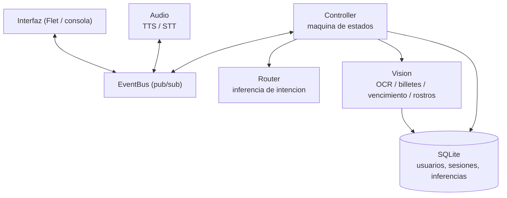

# OJOZ - Asistente virtual inclusivo

Asistente por voz en español que convierte información visual en audio para
apoyar a personas con discapacidad visual en tareas cotidianas: leer documentos,
identificar billetes y verificar fechas de vencimiento.

Proyecto universitario desarrollado en Python, con arquitectura en capas
orientada a objetos, comunicación desacoplada por eventos y persistencia
relacional de resultados.

---

## Descripción general

La interacción es enteramente por voz. El asistente saluda, registra o autentica
al usuario mediante reconocimiento facial y, a partir de ahí, atiende peticiones
habladas en lenguaje natural. Cada operación de visión por computador se ejecuta
sobre la cámara del equipo y su resultado se comunica al usuario por síntesis de
voz, además de registrarse en base de datos junto con su métrica de confianza.

## Funcionalidades

| Función | Descripción | Tecnología |
|---|---|---|
| Registro y autenticación | Enrolamiento facial (300 capturas) y verificación por reconocimiento | OpenCV, LBPH |
| Lectura de documentos | Extracción y lectura en voz alta del texto de un documento | Tesseract OCR |
| Identificación de dinero | Detección del valor de billetes y monedas de sol peruano | OpenCV, Tesseract |
| Verificación de vencimiento | Localización de la fecha de caducidad e indicación de si el producto está vigente | OpenCV, Tesseract |
| Interacción por voz | Reconocimiento de habla e inferencia de intención en español | SpeechRecognition, gTTS |

## Arquitectura



El `Controller` mantiene una máquina de estados (`IDLE`, `TTS_SPEAKING`,
`LISTENING`, `PROCESSING`) que alterna los turnos entre voz y micrófono: mientras
el sintetizador habla, el reconocimiento de voz queda silenciado, y los flujos de
visión no se inician hasta recibir el evento `tts:end`. De este modo el asistente
no se escucha a sí mismo. Un hilo de vigilancia reactiva el micrófono si ese
evento no llega, evitando que la aplicación quede bloqueada.

Los módulos no se conocen entre sí: se comunican publicando y suscribiéndose a
eventos (`tts:start`, `tts:end`, `stt:text`, `ui:print`) sobre un bus con
bloqueo para uso concurrente.

### Selección del mejor fotograma

Los procesos de OCR, identificación de dinero y verificación de vencimiento no
analizan una única captura. Durante una ventana de varios segundos se puntúa cada
fotograma mediante criterios estadísticos de calidad de imagen (varianza del
laplaciano como medida de enfoque, brillo y contraste) y solo se procesan los
mejores candidatos, en un hilo separado del de previsualización.

## Modelo de datos

Base de datos SQLite con ocho tablas normalizadas, siete claves foráneas e
índices sobre las consultas frecuentes.

| Tabla | Contenido |
|---|---|
| `users` | Usuarios registrados |
| `face_photos` | Capturas de rostro asociadas a cada usuario |
| `enrollments` | Sesiones de enrolamiento y número de fotografías |
| `models` | Registro de modelos: tipo, versión, ruta, umbral de decisión, checksum y fecha de entrenamiento |
| `sessions` | Sesiones de uso, resultado y detalle |
| `ocr_results` | Texto extraído, idioma y confianza |
| `currency_detections` | Divisa, valor detectado y confianza |
| `expiry_checks` | Producto, fecha detectada, estado de vigencia y confianza |

Cada inferencia se almacena junto a su métrica de confianza y a la sesión que la
originó, lo que permite trazabilidad y análisis posterior del comportamiento de
los modelos.

## Stack tecnológico

- **Lenguaje:** Python 3.13
- **Visión por computador:** OpenCV (contrib), NumPy, imutils
- **OCR:** Tesseract mediante pytesseract
- **Reconocimiento facial:** LBPH (OpenCV) con clasificador Haar
- **Audio:** gTTS y pyttsx3 (síntesis), SpeechRecognition (reconocimiento), pygame
- **Interfaz:** Flet
- **Persistencia:** SQLite

## Requisitos previos

- Python 3.13
- Cámara web y micrófono
- Conexión a internet (el reconocimiento y la síntesis de voz usan servicios en línea)
- **Tesseract OCR** con el paquete de idioma español (`spa`).
  Descarga: <https://github.com/UB-Mannheim/tesseract/wiki>.
  Se busca por defecto en `C:\Program Files\Tesseract-OCR\tesseract.exe`; puede
  indicarse otra ruta mediante la variable de entorno `TESSERACT_CMD`.
- **Clasificador Haar de rostros** (`haarcascade_frontalface_default.xml`).
  OpenCV 5 ya no distribuye estos archivos, por lo que debe aportarse:
  1. Copiarlo en `assets/haarcascades/`, o
  2. indicar su ruta mediante la variable de entorno `HAARCASCADE_PATH`, o
  3. instalar OpenCV 4.x, que sí lo incluye.

  Sin este archivo, el registro y la autenticación facial se interrumpen con un
  mensaje explicativo; el resto de funcionalidades opera con normalidad.

## Instalación

Los módulos internos se importan como paquete `app`, por lo que el repositorio
debe clonarse en un directorio con ese nombre:

```bash
git clone https://github.com/<usuario>/<repositorio>.git app
cd app
python -m venv venv
venv\Scripts\activate
pip install -r requirements.txt
```

## Ejecución

Desde el directorio **padre** de `app`:

```bash
python -m app.main_flet    # interfaz gráfica (recomendado)
python -m app.main         # modo consola
```

## Uso

1. El asistente saluda y pregunta si es la primera vez del usuario o si ya
   dispone de una cuenta registrada.
2. Si es nuevo, solicita su nombre e inicia el enrolamiento facial. Si ya está
   registrado, procede a la autenticación por reconocimiento.
3. Una vez autenticado, se enuncia por voz la opción deseada:

| Opción | Función | Frases de ejemplo |
|---|---|---|
| 1 | Leer un documento | "primera opción", "lee este documento" |
| 2 | Identificar el valor del dinero | "segunda opción", "cuánto vale esto" |
| 3 | Verificar fecha de vencimiento | "tercera opción", "fecha de vencimiento" |
| 4 | Descripción de la escena (servicio externo) | "cuarta opción", "describe lo que ves" |

Para finalizar: "salir" cierra la sesión y "cerrar aplicación" termina el
programa.

## Estructura del proyecto

```
app/
├── main.py, main_flet.py     Puntos de entrada (consola / interfaz gráfica)
├── core/
│   ├── controller.py         Orquestación: máquina de estados y flujos de negocio
│   ├── event_bus.py          Bus de eventos publicador/suscriptor
│   └── router.py             Inferencia de intención a partir del texto
├── audio/                    Síntesis (tts.py) y reconocimiento de voz (stt.py)
├── vision/                   OCR, dinero, vencimiento, rostros y acceso a cámara
├── db/                       Motor, capa de acceso a datos y esquema SQL
├── ui/                       Interfaz Flet y vista de consola
├── config/settings.py        Configuración centralizada
├── utils/                    Registro de eventos y utilidades de sistema de archivos
├── tools/                    Utilidades de diagnóstico ajenas al tiempo de ejecución
├── assets/                   Recursos estáticos
└── data/                     Datos generados en ejecución (excluidos del repositorio)
```

## Utilidades de diagnóstico

```bash
python -m app.tools.check_camera             # cámaras detectadas por OpenCV
python -m app.tools.list_voices              # voces de síntesis disponibles
python -m app.tools.db_check                 # usuarios registrados
python -m app.tools.test_ocr_image <imagen>  # prueba de OCR sobre una imagen
```

## Tratamiento de datos personales

La aplicación captura y almacena localmente fotografías de rostro, nombres de
usuario y resultados de inferencia. Todo ello se genera bajo `data/`, directorio
excluido del control de versiones. **No debe incorporarse al repositorio**:
contiene datos biométricos y personales.

## Limitaciones conocidas

- La identificación de dinero está calibrada para billetes y monedas de sol
  peruano.
- El reconocimiento y la síntesis de voz dependen de servicios en línea y
  requieren conexión a internet.
- El reconocimiento facial emplea LBPH, adecuado para conjuntos reducidos y
  condiciones de iluminación estables.

## Autor

Ricco Rashuamán — Proyecto universitario.
